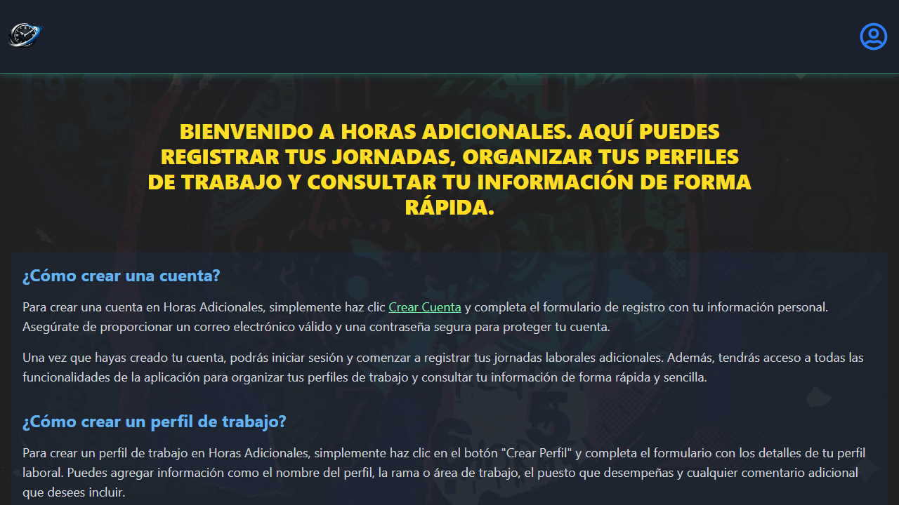

# Horas Adicionales


Aplicacion web para registrar horas trabajadas por jornada, gestionar perfiles de trabajo y centralizar el calculo de jornadas por usuario autenticado.

## Tabla de contenido

- [Resumen](#resumen)
- [Capturas](#capturas)
- [Funcionalidades](#funcionalidades)
- [Stack tecnico](#stack-tecnico)
- [Requisitos](#requisitos)
- [Configuracion de entorno](#configuracion-de-entorno)
- [Instalacion y ejecucion](#instalacion-y-ejecucion)
- [Scripts disponibles](#scripts-disponibles)
- [Estructura del proyecto](#estructura-del-proyecto)
- [Documentacion oficial](#documentacion-oficial)
- [Roadmap corto](#roadmap-corto)

## Resumen

El proyecto esta construido con React + TypeScript + Vite y utiliza Firebase Authentication y Cloud Firestore para gestionar datos por usuario.

Casos de uso principales:

- Registrar jornada por perfil de trabajo.
- Consultar registros historicos.
- Mantener perfiles de trabajo con datos asociados.
- Gestionar estado de sesion y cuenta de usuario.

## Capturas

### Home




### Records


## Funcionalidades

- Inicio y cierre de sesion con Google.
- Rutas privadas para records, job-profiles y account.
- Alta y listado de registros de jornada.
- Creacion y listado en tiempo real de perfiles de trabajo.
- Operaciones CRUD de perfiles desde capa de servicios.
- Vista de cuenta autenticada y actualizacion de datos basicos.

## Stack tecnico

- React 19
- TypeScript 5
- Vite 7
- Firebase 12 (Auth + Firestore)
- React Router 7
- Tailwind CSS 4
- React Toastify 11
- ESLint 9 + Prettier 3

## Requisitos

- Node.js 20 o superior
- npm 10 o superior
- Proyecto Firebase con Authentication (Google) y Firestore habilitados

## Configuracion de entorno

1. Crear archivo `.env.local` en la raiz.
2. Copiar plantilla desde [.env.example](.env.example).
3. Completar valores reales de Firebase.

Variables requeridas:

```env
VITE_API_KEY=
VITE_AUTH_DOMAIN=
VITE_DATABASE_URL=
VITE_PROJECT_ID=
VITE_STORAGE_BUCKET=
VITE_MESSAGING_SENDER_ID=
VITE_APP_ID=
```

Nota: solo variables con prefijo `VITE_` se exponen al cliente en Vite.

## Instalacion y ejecucion

```bash
npm install
npm run dev
```

Servidor local esperado:

- `http://localhost:5173` (o el siguiente puerto libre)

## Scripts disponibles

| Script | Descripcion |
| --- | --- |
| `npm run dev` | Inicia servidor de desarrollo |
| `npm run build` | Compila TypeScript y genera build de produccion |
| `npm run preview` | Sirve la build de produccion localmente |
| `npm run lint` | Ejecuta ESLint |
| `npm run lint:fix` | Ejecuta ESLint con autofix |
| `npm run format` | Formatea con Prettier |
| `npm run format:check` | Verifica formato con Prettier |
| `npm run seed:catalog` | Poblado de catalogos en Firestore |
| `npm run seed:catalog:dry` | Simulacion de poblado de catalogos |
| `npm run seed:utilities` | Poblado de utilidades en Firestore |
| `npm run seed:utilities:dry` | Simulacion de poblado de utilidades |

## Estructura del proyecto

```text
src/
  apis/                # Configuracion de Firebase
  components/          # Componentes UI reutilizables
  context/             # Context API, hooks y providers
  hooks/               # Hooks de aplicacion
  json/                # Catalogos estaticos
  pages/               # Modulos de cuenta, records y job profiles
  routes/              # Definicion de rutas y actions
  services/            # Logica de negocio y acceso a datos
  types/               # Tipos TypeScript
  utils/               # Utilidades compartidas
scripts/               # Scripts de poblado de datos
public/                # Recursos estaticos
```

## Documentacion oficial

- React: https://react.dev/
- TypeScript: https://www.typescriptlang.org/docs/
- Vite: https://vite.dev/guide/
- Firebase: https://firebase.google.com/docs
- React Router: https://reactrouter.com/home
- Tailwind CSS: https://tailwindcss.com/docs
- React Toastify: https://fkhadra.github.io/react-toastify/introduction/

## Roadmap corto

- Mejorar filtros de registros por fecha y perfil.
- Incrementar cobertura de tests en servicios y hooks.
- Documentar reglas de seguridad de Firestore por entorno.
- Añadir pipeline CI para lint, format y build.
